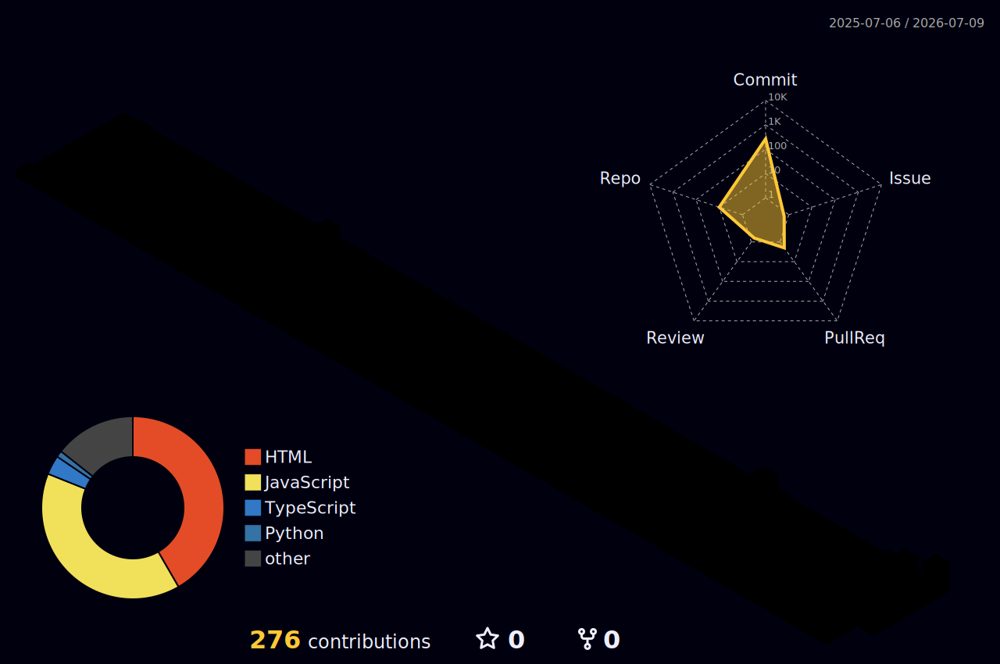

<div align="center">

[](mailto:calvinja320@gmail.com)
&nbsp;
[](https://linkedin.com/in/calvin-jude-dsouza)
&nbsp;
[](https://courageous-pithivier-cb9e32.netlify.app)
&nbsp;
[](https://github.com/Cal2-0)

<br/>


&nbsp;


</div>

<br/>

---

```
┌──(calvin㉿kali)-[~]
└─$ whoami

  ╔══ B.Tech Cybersecurity @ NMAMIT · CGPA 9.26/10 ══════════════════════════╗
  ║  Offensive Security dev bridging the gap between attack & user experience  ║
  ║  AI-driven diagnostics · Enterprise logistics · Cryptographic systems      ║
  ║  CTF competitor · Hackathon veteran · Builder of "MNC-Grade" systems       ║
  ╚══════════════════════════════════════════════════════════════════════════ ✓ ╝
```

<br/>

<div align="center">

| 🎓 CGPA | 🏴 CTFs Competed | 🛠️ Projects Built | 🏆 Hackathon Podium | ⭐ GitHub Stars |
|:---:|:---:|:---:|:---:|:---:|
| **9.26 / 10** | **7+** | **9+** | **1** | **Growing** |

</div>

<br/>

---

## 📊 &nbsp; GitHub Analytics

<br/>

<div align="center">


&nbsp;


<br/><br/>


</div>

<br/>

---

## 🧊 &nbsp; 3D Contribution Graph

<br/>

<div align="center">

<!-- 3D contribution graph — auto-generated daily via GitHub Actions -->
<!-- Setup: https://github.com/yoshi389111/github-profile-3d-contrib -->

<picture>
  <source media="(prefers-color-scheme: dark)" srcset="profile-3d-contrib/profile-night-rainbow.svg" />
  <source media="(prefers-color-scheme: light)" srcset="profile-3d-contrib/profile-gitblock.svg" />
  
</picture>

> ⚙️ *Auto-regenerated daily · [See workflow setup ↓](#setup-3d-graph)*

</div>

<br/>

---

## 🔥 &nbsp; Contribution Activity

<br/>

<div align="center">


</div>

<br/>

---

## `01` &nbsp; Selected Work

<br/>

<div align="center">

<table>
<tr>
<td width="50%" valign="top">

### 🛡️ [VIGIL](https://github.com/Cal2-0)
 

Per-process port intelligence — reads `/proc/net/tcp` directly, scores anomalies, outputs AI threat briefs. Zero dependency on userspace tools.

</td>
<td width="50%" valign="top">

### ⚡ [SentinelAI](https://github.com/Cal2-0)
 

3-agent parallel audit — log anomaly detection, CVE risk ranking & AST-based package inspection. Built for real codebases.

</td>
</tr>
<tr>
<td width="50%" valign="top">

### 👁️ [Lucent](https://courageous-pithivier-cb9e32.netlify.app)
 

Multi-layer deepfake detection fusing FFT + spatial vision + reverse-diffusion into legal-grade audit reports. Court-admissible output format.

</td>
<td width="50%" valign="top">

### 👥 [MassEd.ex](https://github.com/Cal2-0)
 

Real-time crowd intelligence — 50+ objects @ 30 FPS with 4-pattern automated danger-zone behavioural analysis.

</td>
</tr>
<tr>
<td width="50%" valign="top">

### 🧠 [OuchMyBrain.io](https://courageous-pithivier-cb9e32.netlify.app)
 

Transforms study materials into adaptive flashcards, quizzes & spaced repetition audio. **Runners-Up @ ACEathon.**

</td>
<td width="50%" valign="top">

### 🧬 [NeuroMetric](https://courageous-pithivier-cb9e32.netlify.app)
 

Extracts gaze stability, facial affect, speech rate & psychomotor biomarkers from live psychiatric consultations.

</td>
</tr>
<tr>
<td width="50%" valign="top">

### 🎭 [VibeAlchemy](https://github.com/Cal2-0)
 

Chrome extension generating context-aware movie recommendations based on user vibes + active webpage content.

</td>
<td width="50%" valign="top">

### 📦 [IMS Enterprise](https://github.com/Cal2-0)
 

End-to-end inventory & logistics management system designed for warehouse food supply chains at enterprise scale.

</td>
</tr>
<tr>
<td width="50%" valign="top">

### 📡 [NetRecon](https://courageous-pithivier-cb9e32.netlify.app)
 

Maps a /24 subnet (254 hosts) in under **12s** via raw Unix sockets — 100% rogue device detection in live ARP tests.

</td>
<td width="50%" valign="top">

<br/><br/>

> 📁 Full archive → [courageous-pithivier-cb9e32.netlify.app](https://courageous-pithivier-cb9e32.netlify.app)

</td>
</tr>
</table>

</div>

<br/>

---

## `02` &nbsp; Technical Arsenal

<br/>

### 🔤 Languages & Core

<div align="center">

[](https://skillicons.dev)

</div>

<br/>

### 🤖 AI & Machine Learning

<div align="center">

[](https://skillicons.dev)
&nbsp;


</div>

<br/>

### ⚙️ Frameworks & Infrastructure

<div align="center">

[](https://skillicons.dev)

</div>

<br/>

### 🛡️ Cybersecurity Toolkit

<div align="center">

[](https://skillicons.dev)
&nbsp;


<br/>


</div>

<br/>

---

## 🏆 &nbsp; GitHub Trophies

<br/>

<div align="center">

[](https://github.com/ryo-ma/github-profile-trophy)

</div>

<br/>

---

## `03` &nbsp; Recognition & Achievements

<br/>

<div align="center">

| Award | Event | Detail |
|:---|:---|:---|
| 🥈 **Runners-Up** | ACEathon Hackathon | OuchMyBrain.io — AI-powered study companion |
| 🏴 **4th Place** | HackFest '26 Sidequest CTF | 10-hour intensive cybersecurity event |
| 🏴 **7th Place** | Code Intrusion CTF | Digital forensics + web exploitation |
| 🏴 **14th / 200+** | Enyugma CTF | Specialised in OSINT & reverse engineering |
| 🎖️ **Special Commendation** | Innovex Hackathon | Exceptional strategic thinking & execution |
| 🏛️ **Certificate** | IISc Bangalore · Pravega | 2-day intensive cybersecurity workshop |
| 🏛️ **Certificate** | CYSECK NITK | Cybersecurity bootcamp + CTF |
| 📜 **In Progress** | CompTIA Security+ · CHFI · eJPT | Formalising expertise in network security & forensics |

</div>

<br/>

---

## `04` &nbsp; Experience

<br/>

<details>
<summary><b>⚡ Cybersecurity Developer Intern & Team Lead</b> &nbsp;·&nbsp; NMAMIT &nbsp;·&nbsp; <i>Jan – May 2025</i></summary>
<br/>

Directed a 6-member team to engineer **VisionEX** — an enterprise-grade digital certification suite. Implemented Diffie-Hellman key exchange for secure authenticated channels and integrated Minimax algorithms for cryptographic optimisation.

</details>

<details>
<summary><b>📋 Class Representative</b> &nbsp;·&nbsp; NMAMIT Cybersecurity Dept &nbsp;·&nbsp; <i>Jan 2026 – 2027</i></summary>
<br/>

Orchestrated branch-level festival logistics and task delegation across cross-functional teams of 20+ members.

</details>

<details>
<summary><b>⚙️ Core Member — PROTON</b> &nbsp;·&nbsp; College Association &nbsp;·&nbsp; <i>Aug 2025 – 2026</i></summary>
<br/>

Co-organised collegiate CTF competitions. Conceptualised campus events including *Game of Conquest* and *Fish Tank*.

</details>

<br/>

---

## `05` &nbsp; Education

<br/>

```
🎓  B.Tech in Cybersecurity      NMAM Institute of Technology      2024 – 2028      CGPA: 9.26 / 10.0
📚  Higher Secondary             Indian High School, Dubai          2010 – 2022      Score: 8.91
```

<br/>

---

## 📬 &nbsp; Let's Connect

<br/>

<div align="center">

| | Platform | Handle |
|:---:|:---|:---|
| 📧 | Email | [calvinja320@gmail.com](mailto:calvinja320@gmail.com) |
| 💼 | LinkedIn | [linkedin.com/in/calvin-jude-dsouza](https://linkedin.com/in/calvin-jude-dsouza) |
| 🐙 | GitHub | [github.com/Cal2-0](https://github.com/Cal2-0) |
| 🌐 | Portfolio | [courageous-pithivier-cb9e32.netlify.app](https://courageous-pithivier-cb9e32.netlify.app) |

</div>

<br/>

---


<div align="center">


*© 2026 · Calvin Jude Dsouza · MNC-Grade Systems & Security*

</div>
