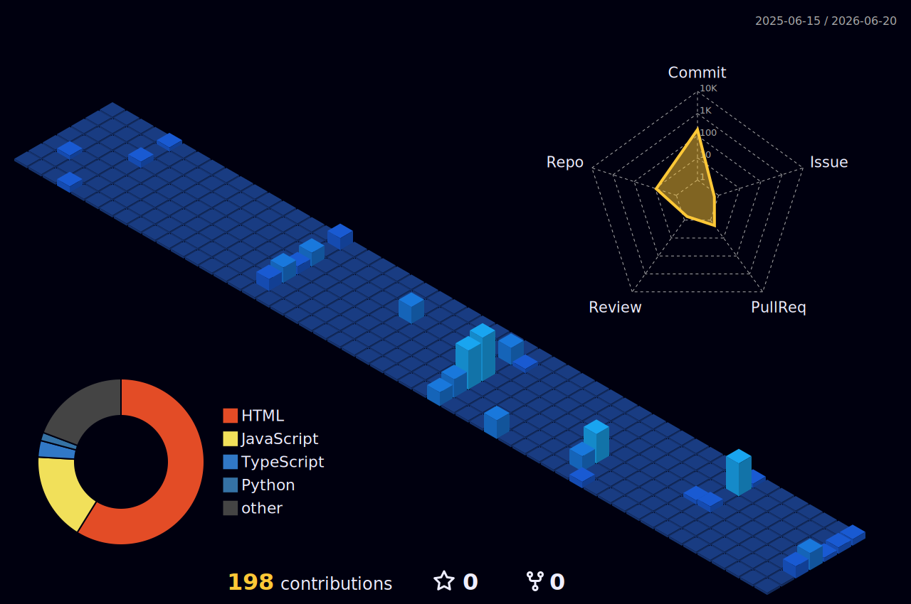

<pre align="left" style="font-family: monospace; background: transparent; padding: 0; color: #8a7a6a;">
┌──(calvin㉿kali)-[~]
└─$ whoami

  ╔══ B.Tech Cybersecurity @ NMAMIT · CGPA 9.26/10 ══════════════════════════╗
  ║  Offensive Security dev bridging the gap between attack & user experience  ║
  ║  AI-driven diagnostics · Enterprise logistics · Cryptographic systems      ║
  ║  CTF competitor · Hackathon veteran · Builder of "MNC-Grade" systems       ║
  ╚══════════════════════════════════════════════════════════════════════════✓ ╝
</pre>

 

&nbsp;

&nbsp;

&nbsp;

---

 

## ✦ &nbsp; Selected Work

 

| &nbsp; | Project | Category | Description |
|:---:|:---|:---:|:---|
| 🛡️ | **[VIGIL](https://github.com/Cal2-0)** | `Linux · Security` | Per-process port intelligence. Reads `/proc/net/tcp` directly, scores anomalies, outputs AI threat briefs |
| ⚡ | **[SentinelAI](https://github.com/Cal2-0)** | `AI · Audit` | 3-agent parallel security audit: log anomaly detection, CVE risk ranking & AST-based package inspection |
| 👁 | **[Lucent](https://courageous-pithivier-cb9e32.netlify.app)** | `AI · Forensics` | Multi-layer deepfake detection fusing FFT analysis, spatial vision models & reverse-diffusion checks into legal-grade audit reports |
| 👥 | **[MassEd.ex](https://github.com/Cal2-0)** | `Computer Vision` | Real-time crowd intelligence via YOLOv8 — 50+ objects at 30 FPS. Automated danger-zone detection with 4-pattern behavioural analysis |
| 🧬 | **[NeuroMetric](https://courageous-pithivier-cb9e32.netlify.app)** | `AI · Health` | Extracts gaze stability, facial affect, speech rate & psychomotor biomarkers from psychiatric consultations |
| 📦 | **[IMS Enterprise](https://github.com/Cal2-0)** | `Full Stack` | End-to-end inventory and logistics management system designed for warehouse food supply chains |
| 📡 | **[NetRecon](https://courageous-pithivier-cb9e32.netlify.app)** | `Network` | Maps a /24 subnet (254 hosts) in under 12s via raw Unix sockets — 100% rogue device detection in live ARP tests |

 

---

## ✦ &nbsp; The Lab (Built, Not Shipped)

*Experimental systems, internal prototypes, and classified research.*

 

| Status | Project | Stack | Focus |
|:---:|:---|:---|:---|
| 🚧 | **VisionEX** | `C` `Minimax` `Diffie-Hellman` | Enterprise-grade digital certification suite with highly optimized cryptographic channels |
| 🧪 | **Kensho** | `Python` `Go` | Autonomous network intelligence — real-time anomaly detection across telemetry streams |
| 🛠️ | **CalHive** | `TypeScript` `NLP` | AI productivity platform classifying tasks via sentence-transformer embeddings |

 

---

## ✦ &nbsp; Technical Arsenal

 

**Languages & Core**

 

**AI & Security**

 

---

## ✦ &nbsp; GitHub Analytics

 

  

&nbsp;

 

---

## ✦ &nbsp; Podium & Recognition

 

| Honour | Event | Detail |
|:---|:---|:---|
| 🏆 **Podium Finish** | **ACEathon Hackathon** | **🥈 2nd Place Overall** — OuchMyBrain.io |
| 🏴 4th Place | HackFest '26 Sidequest | 10-hour intensive cybersecurity CTF event |
| 🏴 7th Place | Code Intrusion CTF | Digital forensics + web exploitation |
| 🏴 14th / 200+ | Enyugma CTF | Specialising in OSINT & reverse engineering |
| 🎖 Commendation | Innovex Hackathon | Awarded for exceptional strategic execution |

 

---

 

*© 2026 &nbsp;·&nbsp; Calvin Jude Dsouza &nbsp;·&nbsp; MNC-Grade Systems & Security*

&nbsp;

