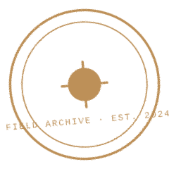
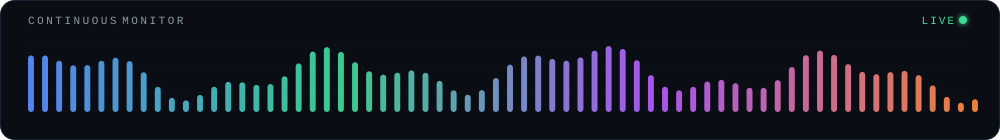

<h1>CHAIN OF CUSTODY</h1>
<b>FIELD ARCHIVE OF CALVIN J. DSOUZA</b> &nbsp;·&nbsp; CYBERSECURITY &amp; APPLIED AI

  

<i>Every system leaves a trace. This is mine.</i>

  

&nbsp;
&nbsp;
&nbsp;

 

 

## INTAKE

> B.Tech Cybersecurity, NMAM Institute of Technology — CGPA 9.26/10, Class of 2028.
> Builds investigation platforms rather than dashboards: systems that establish *what happened*, not just *that something did*. Blockchain forensics, network intelligence, deepfake signal analysis, applied AI — all variations on the same question: can a machine produce evidence a human would trust?

| Field | Record |
|:--|:--|
| Institution | NMAM Institute of Technology, Karkala |
| Standing | CGPA 9.26 / 10.0 |
| Current post | Team Lead, Cybersecurity Intern — Army Cyber Group, New Delhi |
| Status | Open to internships &amp; collaborative research |

 

 

## OPEN CASES

Currently under active investigation:

- **AXON** — extending the behavioural forensics engine and threat-intel corpus
- **Lucent.ai** — interpretable deepfake signal research
- **NeuroMetric** — multimodal behavioural analytics prototype

 

 

## EXHIBITS I–VII — SECURITY, FORENSICS &amp; SYSTEMS

 

### EXHIBIT I — AXON

**Blockchain Behavioural Forensics &amp; Threat Intelligence Platform**
`React` `D3.js` `FastAPI` `Python` `SQLAlchemy` `Etherscan` `Forta`

Evaluates what a wallet *does* rather than what it's labelled. A 5-layer behavioural engine correlates transaction rhythm, fan-out topology and liquidity movement, then renders the relationships as interactive D3 force graphs and Sankey flows.

- 5-layer behavioural engine — rhythm, topology, economic pass-through
- Prosecution / Defense / Judge multi-agent adversarial verdict architecture
- Cross-platform OSINT enrichment against a 13,847+ entity threat corpus

**[View Repository →](https://github.com/Cal2-0/Axon)**

 

### EXHIBIT II — SentinelAI

**AI-Assisted Linux Incident Response Engine**
`Python` `Streamlit` `asyncio` `Isolation Forest` `AST Analysis` `NVD` `EPSS`

Runs three independent security analyses — auth-log anomalies, package vulnerability exposure, installed-code behaviour — and consolidates them into one prioritised report.

- **ThreatTrace** — Isolation Forest over auth logs, scored on timing/failure/IP reputation
- **VulnRank** — installed packages mapped against NVD + EPSS
- **PacketSpy** — AST-level inspection of installed Python packages, no dynamic execution

**[View Repository →](https://github.com/Cal2-0/Sentinel-IP)**

 

### EXHIBIT III — SecureCI

**AI-Assisted GitHub Actions Security Scanner**
`Python` `YAML Analysis` `Gemini` `OWASP CI/CD`

Audits GitHub Actions workflows for unpinned actions, excessive permissions, exposed secrets and poisoned-pipeline patterns like unsafe `pull_request_target` usage — with optional AI-assisted remediation.

- Recursive `.github/workflows` scanning with structured JSON output
- Detects hardcoded credentials and missing permission restrictions

**[View Repository →](https://github.com/Danish4h-135/SecureCI)**

 

### EXHIBIT IV — VisionEX

**Enterprise Zero-Trust Security Suite**
`OAuth2` `RBAC` `IAM` `Session Security` `Network Telemetry`

Led a 6-engineer team through an authentication architecture built on zero-trust principles — OAuth2, strict RBAC, continuous monitoring. Cleared three external security audits with zero critical vulnerabilities.

- Zero-trust identity architecture across the full auth stack
- Addressed OWASP Top 10 alongside network-level intrusion vectors

*Repository not publicly listed.*

 

### EXHIBIT V — NetScope X v2.0

**Real-Time Network Intelligence Platform**
`Python` `Flask-SocketIO` `D3.js` `Scapy` `Nmap` `tshark`

Continuously discovers devices, captures traffic and visualises topology in the browser — combining ARP analysis, passive capture and WSL-aware discovery into one live map.

- Detects ARP spoofing, port scans, DNS tunnelling, traffic spikes in real time
- Live D3 topology with per-device risk scoring and deep-scan drill-down

**[View Repository →](https://github.com/Cal2-0/Projects/tree/main/netscope)**

 

### EXHIBIT VI — NetRecon

**Low-Level Raw-Socket LAN Scanner**
`C` `Raw Sockets` `ICMP` `ARP` `TCP`

Device discovery below the usual scanning abstractions — hand-built packet crafting in C, working directly against ICMP, ARP and TCP rather than a scanning library.

- Custom packet-crafting routines for active network mapping
- Systems-level networking knowledge, not a wrapper around nmap

*Repository not publicly listed.*

 

### EXHIBIT VII — Kalera

**Hybrid Post-Quantum Encryption &amp; Steganographic Transport**
`ML-KEM-1024` `Classic McEliece` `SPHINCS+` `HKDF-SHA3` `FastAPI`

A hybrid post-quantum architecture: ML-KEM-1024 and Classic McEliece for key establishment, HKDF-SHA3 for session derivation, then the payload hidden in an ordinary image via chaos-positioned LSB steganography and signed with SPHINCS+.

- Hybrid PQ key establishment + Walsh-Hadamard diffusion layer
- Chaos-positioned steganographic transport with post-quantum signatures

**[View Repository →](https://github.com/betrayed1996/Kalera)**

 

 

## EXHIBITS VIII–XIII — APPLIED INTELLIGENCE &amp; PRODUCT SYSTEMS

 

### EXHIBIT VIII — MassEd.ex

**Real-Time Crowd Intelligence &amp; Event Safety Platform**
`Python` `OpenCV` `YOLOv8` `ByteTrack/DeepSORT` `Flask`

Turns live video into actionable crowd-safety information — detection, multi-object tracking, density heatmaps and region-of-interest danger-zone monitoring, built around continuous telemetry rather than single-frame classification.

- Real-time multi-object tracking in crowded scenes
- Dynamic density heatmaps with ROI danger-zone alerts

**[View Repository →](https://github.com/Cal2-0/Projects/tree/main/Massex)**

 

### EXHIBIT IX — VaidikaAI

**Multilingual AI Hospital Triage &amp; Workflow System**
`LLMs` `Python` `Prompt Engineering`

Built in a 48-hour constraint: a multi-model approach to symptom analysis and risk routing, with conversational workflows designed to speed up patient processing rather than replace clinical judgment.

- Multi-model symptom analysis and risk routing
- Rapid architecture-to-delivery under hard time constraints

**[View Repository →](https://github.com/NITHINKR06/Qwerty201_Protothon)**

 

### EXHIBIT X — OuchMyBrain.io

**AI Adaptive Learning Platform** — 2nd Place, ACEathon
`Python` `Flask` `OpenAI/OpenRouter` `OCR` `ElevenLabs`

Converts PDFs, scans and photos of notes into structured study material — summaries, flashcards, quizzes, and audio lessons via a contextual "Professor Mode."

- OCR ingestion pipeline for unstructured study material
- Layered summarisation, adaptive quizzing, audio lessons

**[View Repository →](https://github.com/ACEathon-2025/Team-39)**

 

### EXHIBIT XI — FinTera

**Financial Planning &amp; Literacy Platform**
`Financial Analytics` `Interactive Calculators`

A responsive personal-finance dashboard — SIP, EMI and tax calculators feeding into planning workflows built for accessibility, not spreadsheet literacy.

- Interactive SIP / EMI / tax calculators
- Dashboard-based planning workflows

*Repository not publicly listed.*

 

### EXHIBIT XII — Lyra

**Developer Tools &amp; Resources Directory**
`React 19` `Vite` `Tailwind` `Radix UI` `Fuse.js`

640+ developer tools organised around intent rather than category, with semantic fuzzy search, a persistent "My Stack," and ⌘K keyboard-first navigation.

- Fuse.js semantic search across the full catalogue
- Persistent stack-building with local storage

**[View Repository →](https://github.com/Cal2-0/guide)**

 

### EXHIBIT XIII — VibeAlchemy

**Context-Aware AI Movie Recommendation Extension**
`Chrome Extension` `LLM Inference`

Recommends films from natural-language moods and themes — and reads the active tab (Netflix, Prime Video, IMDb) as extra context for the recommendation.

- Natural-language semantic recommendation matching
- Page-context awareness across major streaming sites

**[View Repository →](https://github.com/Cal2-0/VibeAlchemy)**

 

 

## OPEN INQUIRIES — ACTIVE RESEARCH

These are investigations, not shipped products. Where a result isn't experimentally validated yet, it's described as a research direction — not a finding.

 

### INQUIRY — Lucent.ai

**Interpretable Deepfake Forensics**
`PyTorch` `OpenCV` `FFT` `Diffusion Reconstruction`

**Research question:** which mathematically interpretable signal anomalies best distinguish genuine media from deepfakes across *unseen* generation methods — and does fusing complementary anomaly descriptors improve generalisation?

Current directions: frequency-domain (FFT) anomalies, diffusion reconstruction error, spatial artefacts, metadata/camera-signature inconsistencies, and fusing these into one generalising signal rather than one detector learning generator-specific tells.

 

### INQUIRY — Kenshō (ケンショウ)

**Tacit Knowledge Capture &amp; Enterprise Workflow AI**
`Python` `PostgreSQL` `LLaMA` `Elasticsearch`

Investigates how the undocumented procedural knowledge an experienced employee carries can be captured, structured, and made searchable before it walks out the door — privacy-first, offline-capable, enterprise-deployable by design.

 

### INQUIRY — NeuroMetric

**Multimodal Behavioural Analytics**
`React Native` `MediaPipe` `Librosa` `ClinicalBERT` `TFLite`

Explores fusing gaze, facial affect, speech and psychomotor signals into structured behavioural representations — framed as exploratory digital-biomarker research, not a diagnostic tool.

 

 

## SUPPLEMENTARY FILES — ENGINEERING LAB

Smaller builds. Not flagship work, but they show range.

 

| Exhibit | What it demonstrates |
|:--|:--|
| **CalHive** | NLP productivity SPA — spaCy-based natural-language task classification |
| **Warehouse Inventory System** | Full-stack inventory management: stock movement, RBAC, capacity tracking |
| **The Health Compass** | Nutrition dashboard with TensorFlow-based food recognition |
| **Movieszbt** | Authenticated movie catalogue + watchlist, TMDB integration |
| **Secure Rooms Chat** | Password-protected room-based chat over WebSocket broadcasting |
| **Universal Studio &amp; Pic Editor** | Media metadata extraction + programmatic image manipulation |
| **Melkit** | Forensics utility — EXIF metadata + GPS coordinate extraction |
| **ai.co** | Modular Flask interface unifying multiple hosted LLM endpoints |
| **SnapShop** | CLIP-embedding image-based product recommendation |
| **Cipher Lab** | Interactive classical cryptography — Caesar, Vigenère, ROT13 |

 

 

## RECORD OF PROCEEDINGS

| Result | Event |
|:--|:--|
| 🥈 Runner-Up | ACEathon Hackathon — OuchMyBrain.io |
| 🏴 4th Place | HackFest '26 Sidequest CTF |
| 🏴 7th Place | Code Intrusion CTF — forensics + web exploitation |
| 🏴 14th / 200+ | Enyugma CTF — OSINT &amp; reverse engineering |
| 🎖️ Special Commendation | Innovex Hackathon |

 

## ASSIGNMENTS ON FILE

- **Team Lead, Cybersecurity Intern** — Army Cyber Group, New Delhi
- **Cybersecurity Developer Intern &amp; Team Lead** — NMAMIT, Jan–May 2025. Led a 6-member team building VisionEX; implemented Diffie-Hellman key exchange across every authenticated channel.
- **Class Representative** — NMAMIT Cybersecurity Dept., Jan 2026–2027. Represents 60+ students on academic and administrative matters.
- **Core Member, PROTON** — College Cybersecurity Association, Aug 2025–2026. Designed and ran collegiate CTFs including Game of Conquest and Fish Tank.

<b>Certifications on file</b>

 

- IISc Bangalore · Pravega — Cybersecurity workshop
- CYSECK NITK — Cybersecurity bootcamp + CTF
- In progress: CompTIA Security+, eJPT, CHFI

 

 

## CONTINUOUS MONITOR

 

 

 

## CORRESPONDENCE

Reach the archive directly: **[calvinja320@gmail.com](mailto:calvinja320@gmail.com)** &nbsp;·&nbsp; **[LinkedIn](https://linkedin.com/in/calvin-jude-dsouza)** &nbsp;·&nbsp; **[Portfolio](https://courageous-pithivier-cb9e32.netlify.app)**

Record maintained by the subject. Last updated on commit.

