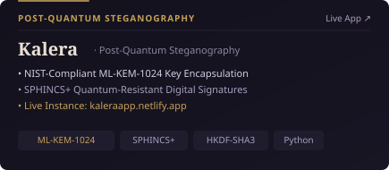
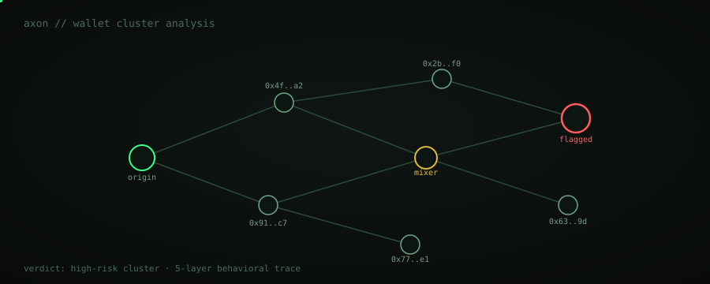
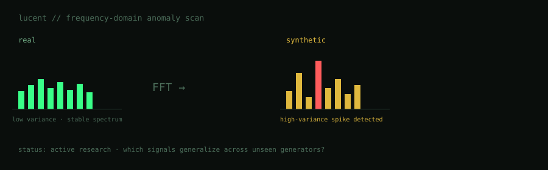
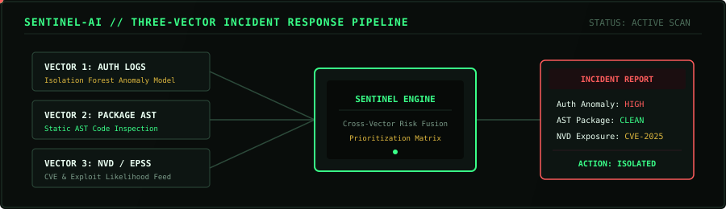
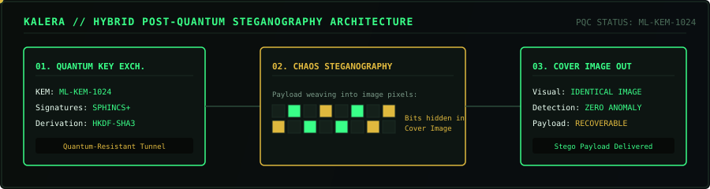
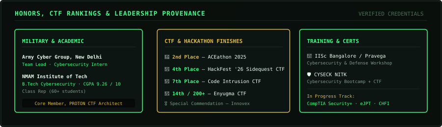

  

  
  
  
  

  
  
  

 

> *"I build investigation platforms rather than dashboards: systems that establish what happened, not just that something did."*

---

## ⚡ Featured Builds & Live Execution Telemetry

<table>
<tr>
  <td width="50%"></td>
  <td width="50%"></td>
</tr>
<tr>
  <td width="50%"></td>
  <td width="50%"></td>
</tr>
</table>

---

## 🔬 Technical Radar & System Arsenal

  

---

## 🔬 Flagship Architecture & Research Deep Dives

### 01. AXON — On-Chain Behavioural Forensics Engine
> *Evaluates what a wallet does rather than what it's labelled.*

  

- **Core Engine:** 5-layer risk evaluation model powered by a prosecution / defense / judge multi-agent verdict framework.
- **Corpus:** 13,847+ entity threat corpus across Ethereum (EVM), Solana, and Bitcoin blockchains.
- **Tech Stack:** `React` · `D3.js` · `FastAPI` · `Etherscan API` · `Alchemy RPC` · `Python`
- 🔗 **Repository:** [github.com/Cal2-0/Axon](https://github.com/Cal2-0/Axon)

---

### 02. Lucent.ai — Interpretable Deepfake Signal Forensics
> *Can a machine produce evidence a human would trust?*

  

- **Research Question:** Which mathematically interpretable frequency-domain anomalies best distinguish genuine media from deepfakes across unseen generation methods?
- **Approach:** FFT spectral decomposition, high-frequency residual analysis, and diffusion reconstruction variance.
- **Tech Stack:** `PyTorch` · `OpenCV` · `FFT` · `Diffusion Reconstruction` · `Python`

---

### 03. SentinelAI — Three-Vector Incident Response Engine
> *Unified forensic scoring across auth logs, dependency AST, and CVE feeds.*

  

- Combines auth-log anomaly detection (`Isolation Forest`), static code inspection of installed packages prior to execution (`AST Parsers`), and exploit likelihood feeds (`NVD/EPSS`) into a single prioritized incident report.
- **Tech Stack:** `Python` · `Isolation Forest` · `AST Analysis` · `Streamlit` · `Gemini 2.0`
- 🔗 **Repository:** [github.com/Cal2-0/Sentinel-IP](https://github.com/Cal2-0/Sentinel-IP-)

---

### 04. Kalera — Hybrid Post-Quantum Steganography
> *Quantum-resistant key establishment paired with steganographic payload transport.*

  

- Features `ML-KEM-1024` key establishment, `SPHINCS+` signatures, and chaos-positioned payload embedding inside ordinary cover images.
- **Tech Stack:** `ML-KEM-1024` · `SPHINCS+` · `HKDF-SHA3` · `Python`
- 🔗 **Repository:** [github.com/betrayed1996/Kalera](https://github.com/betrayed1996/Kalera)

---

## 🏆 Honors, Provenance & Military Cyber Credentials

  

---

## 📚 Complete Project Directory & Selected Works

<table>
<thead>
  <tr>
    <th>Project</th>
    <th>Category & Stack</th>
    <th>Key Contribution & Impact</th>
    <th>Status</th>
  </tr>
</thead>
<tbody>
  <tr>
    <td><b><a href="https://github.com/Cal2-0/Axon">AXON</a></b></td>
    <td><code>Forensics</code> · React, D3.js, FastAPI</td>
    <td>5-layer risk engine, multi-agent adversarial verdicts, 13.8k+ threat corpus.</td>
    <td><code>Active</code></td>
  </tr>
  <tr>
    <td><b>VisionEX</b></td>
    <td><code>Zero-Trust</code> · OAuth2, RBAC, IAM</td>
    <td>Led 6-engineer team. Passed 3 external security audits with 0 critical vulnerabilities.</td>
    <td><code>Enterprise</code></td>
  </tr>
  <tr>
    <td><b><a href="https://github.com/Danish4h-135/SecureCI">SecureCI</a></b></td>
    <td><code>DevSecOps</code> · Python, AST, OWASP</td>
    <td>Audits GitHub Actions for unpinned actions, poisoned pipeline risks, and secret leakage.</td>
    <td><code>Active</code></td>
  </tr>
  <tr>
    <td><b><a href="https://github.com/Cal2-0/Projects">NetScope X</a> + MassEd.ex</b></td>
    <td><code>Network/CV</code> · Scapy, YOLOv8, D3.js</td>
    <td>Live device discovery & DNS tunnel detection paired with real-time crowd computer vision.</td>
    <td><code>Active</code></td>
  </tr>
  <tr>
    <td><b>NetRecon</b></td>
    <td><code>Low-Level C</code> · Raw Sockets, ICMP/TCP</td>
    <td>Hand-crafted packet crafting against raw network sockets without external scanning libraries.</td>
    <td><code>Private</code></td>
  </tr>
  <tr>
    <td><b><a href="https://github.com/betrayed1996/Kalera">Kalera</a></b></td>
    <td><code>PQC / Stego</code> · ML-KEM-1024, SPHINCS+</td>
    <td>Post-quantum key establishment with chaos-positioned image steganography transport.</td>
    <td><code>Prototype</code></td>
  </tr>
  <tr>
    <td><b><a href="https://github.com/Cal2-0/guide">Lyra</a></b></td>
    <td><code>DevTools</code> · React 19, Vite, Fuse.js</td>
    <td>640+ developer tools directory with fuzzy semantic search & ⌘K keyboard navigation.</td>
    <td><code>Active</code></td>
  </tr>
  <tr>
    <td><b><a href="https://github.com/ACEathon-2025/Team-39">OuchMyBrain.io</a></b></td>
    <td><code>AI Platform</code> · OCR, OpenAI, ElevenLabs</td>
    <td>🥈 <b>2nd Place, ACEathon 2025</b>. Converts notes/scans into summaries & audio via "Professor Mode".</td>
    <td><code>Hackathon</code></td>
  </tr>
  <tr>
    <td><b><a href="https://github.com/NITHINKR06/Qwerty201_Protothon">VaidikaAI</a></b></td>
    <td><code>Medical AI</code> · LLMs, Prompt Eng.</td>
    <td>Multilingual hospital triage and automated symptom routing built in 48 hours.</td>
    <td><code>Hackathon</code></td>
  </tr>
  <tr>
    <td><b><a href="https://github.com/Cal2-0/VibeAlchemy">VibeAlchemy</a></b></td>
    <td><code>Browser Ext</code> · Chrome Extension, LLM</td>
    <td>Context-aware movie recommendations reading active browser tabs as extra context.</td>
    <td><code>Active</code></td>
  </tr>
  <tr>
    <td><b>Kenshō (ケンショウ)</b></td>
    <td><code>Knowledge AI</code> · LLaMA, Postgres, ES</td>
    <td>Tacit workplace knowledge capture engine — offline-capable and privacy-first.</td>
    <td><code>Research</code></td>
  </tr>
  <tr>
    <td><b>NeuroMetric</b></td>
    <td><code>Biomarkers</code> · React Native, MediaPipe</td>
    <td>Fuses gaze, facial affect, and speech into structured psychomotor representations.</td>
    <td><code>Research</code></td>
  </tr>
</tbody>
</table>

<b>View Additional Minor Works & Archived Studies (10+ Projects)</b>

 

| Project | Domain / Stack | Description |
|:---|:---|:---|
| **CalHive** | spaCy NLP | SPA for automatic task intent classification |
| **Warehouse Inventory** | Full-Stack | Stock monitoring, capacity tracking, and RBAC |
| **The Health Compass** | TensorFlow / Vision | Real-time food recognition + nutritional analytics |
| **Movieszbt** | TMDB API | Media discovery and interactive watchlist application |
| **Secure Rooms Chat** | WebSockets | Encrypted, password-protected real-time chat rooms |
| **Universal Pic Editor** | Metadata / EXIF | EXIF metadata parser + programmatic image editing |
| **Melkit** | GPS Forensics | EXIF/GPS forensic extraction utility for field images |
| **ai.co** | Flask / LLM | Unified Flask interface across self-hosted and cloud LLMs |
| **SnapShop** | CLIP / Embeddings | Visual similarity search for e-commerce products |
| **Cipher Lab** | Cryptography | Interactive visualization for classical ciphers (Vigenère, ROT13) |

---

## 📊 Live Telemetry & GitHub Analytics

  

  

### 🐍 Contribution Stream

<picture>
  <source media="(prefers-color-scheme: dark)" srcset="https://raw.githubusercontent.com/Cal2-0/Cal2-0/output/github-contribution-grid-snake-dark.svg"/>
  <source media="(prefers-color-scheme: light)" srcset="https://raw.githubusercontent.com/Cal2-0/Cal2-0/output/github-contribution-grid-snake.svg"/>
  
</picture>

---

  <i>Record maintained by Calvin Jude Dsouza · Security Engineer & Applied AI Researcher</i> 
  <a href="mailto:calvinja320@gmail.com">calvinja320@gmail.com</a> · <a href="https://linkedin.com/in/calvin-jude-dsouza">LinkedIn</a> · <a href="https://courageous-pithivier-cb9e32.netlify.app">Portfolio</a>

